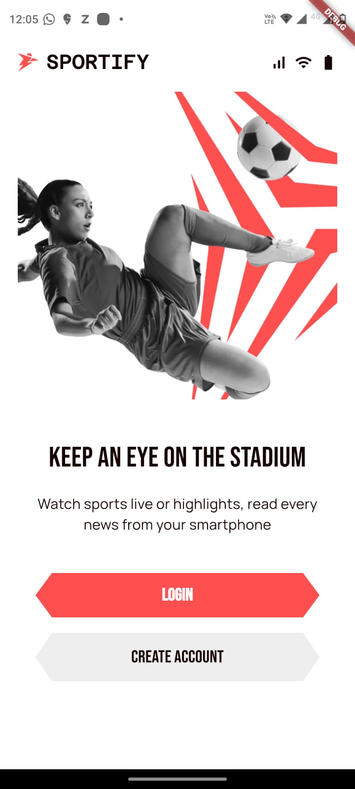
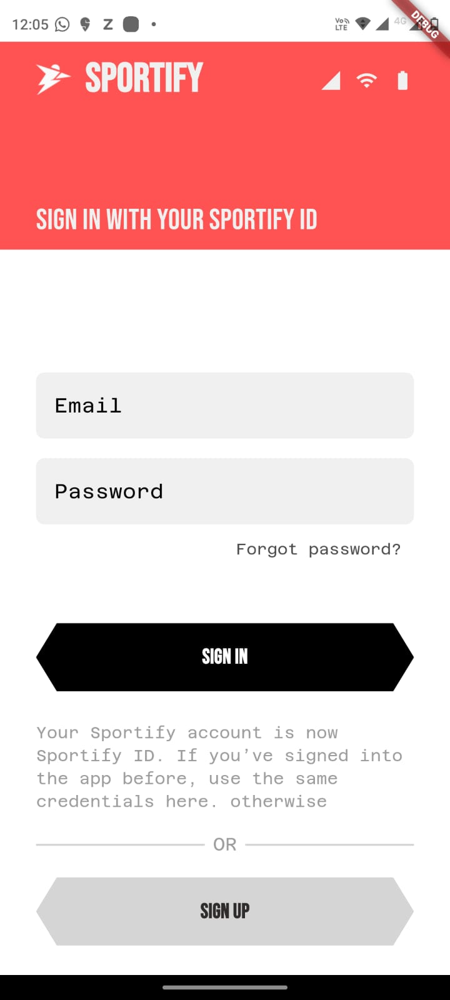
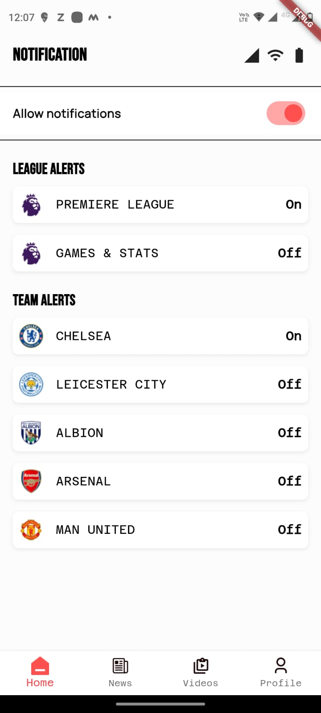
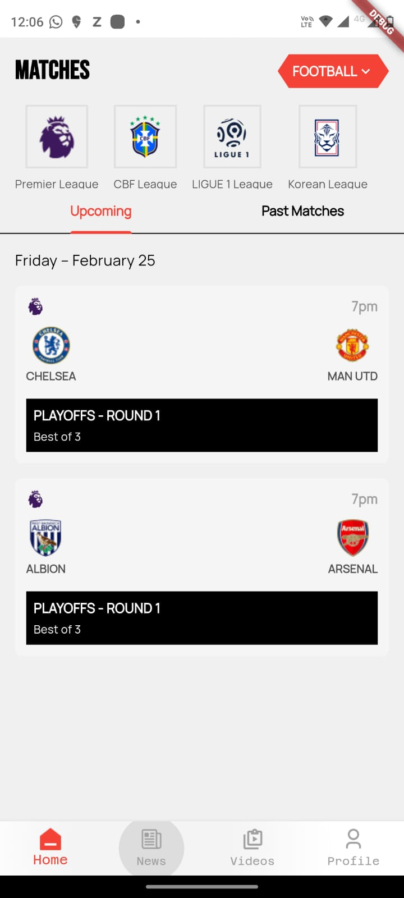

# Profile screen

 

## Time Breakdown

The total time taken to generate the code was **28 minutes (0.46 hours)**. Below is a detailed breakdown of the time spent on each feature:

| **Feature**            | **Time Spent** |
|------------------------|----------------|
| Profile screen         | 06 mins        |
| Api Integration        | 6 mins        |
| Manual fixed           | 16 mins        |
| **Total**              | **28 mins**   |

## Test Coverage

The project achieved **91% pass rate** for unit test cases covering UI, functionality, Api Integration and coding standards without the need for manual coding. Detailed test results can be found in the [pass percentage.xlsx](https://docs.google.com/spreadsheets/d/15Vxh0kxvVFEYxmjWIdty4ZNvR2qBQjKr/edit?usp=sharing&ouid=116493966492613948949&rtpof=true&sd=true) file.

## Screenshots

*Screenshots of the application's output will be added here.*

    

        <b>Onboarding Screen</b>
        
    

    

        <b>Sign-in/Log-in Screen</b>
        
    

    

        <b>Sign-up Screen</b>
        
    

    

        <b>Profile Screen</b>
        
    

    

        <b>Notification Screen</b>
        
    

    

        <b>Teams follow Screen</b>
        
    

    

        <b>Teams following Screen</b>
        
    

    

        <b>Players follows Screen</b>
        
    

    

        <b>Up comming matches Screen</b>
        
    

    

        <b>Stats Screen</b>
        
    

## Upskill result

This document provides detailed instructions and is part of the upskilling initiative from HuTouch.: [Upskill.txt](upskill.txt)
---
